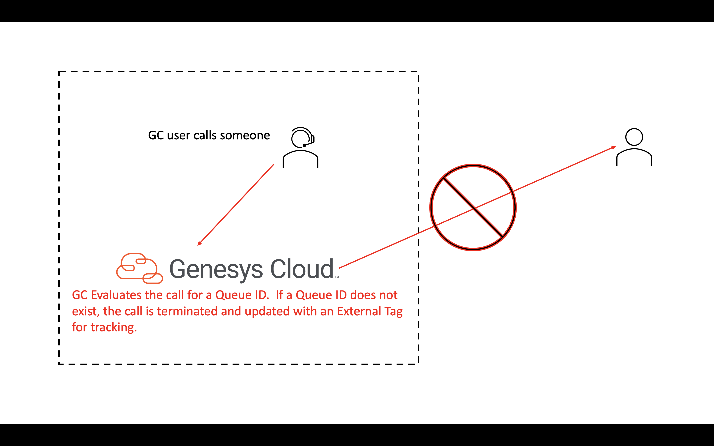

# Terminate an outbound voice call with no queue and place an external tag on the call for analytics and follow-up

This Genesys Cloud Developer Blueprint explains how to set up Genesys Cloud to terminate an outbound voice call with no queue and place an external tag on the call for analytics and follow-up.

When an Architect workflow receives a Communicate call trigger, multiple Genesys Cloud Public API calls are made to update the conversation with an External Tag and then terminate the call.

The following illustration shows the end-to-end user experience that this solution enables.

