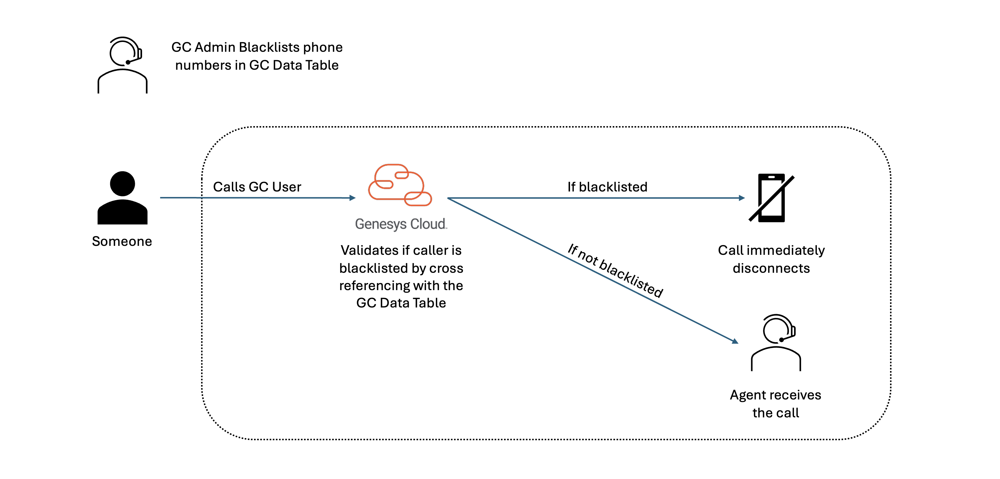

# Blacklisting Phone Numbers

This is a blueprint is a solution for idea INB-I-1146 (https://genesyscloud.ideas.aha.io/ideas/INB-I-1146). As we’ll setup a trigger to check if an ANI on a voice interaction is blacklisted and if it is, we’ll disconnect the call.

The following illustration shows the end-to-end user experience that this solution enables.

