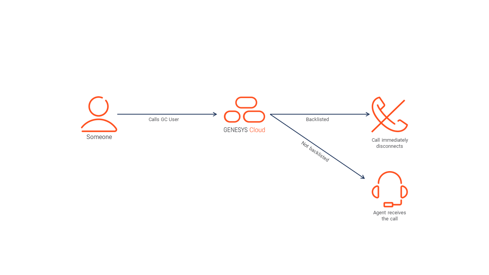
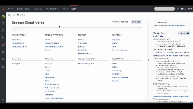
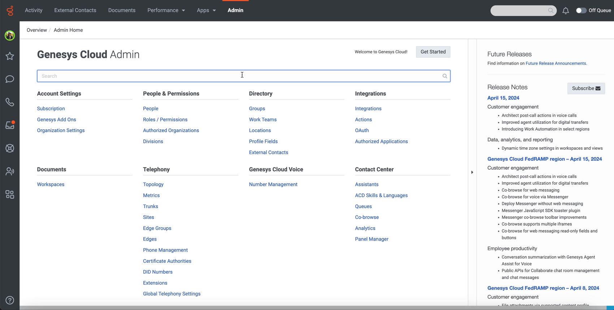

This Genesys Cloud Developer Blueprint explains how to set up a trigger to check if an ANI on an inbound voice interaction is blacklisted. If it is blacklisted, the call is disconnected. This functionality prevents unwanted and fraudulent inbound calls.
 
When an Architect workflow receives a customer call trigger, multiple Genesys Cloud Public API calls are made to determine if the inbound number is blacklisted and to terminate the call accordingly.



The following illustration shows the end-to-end user experience that this solution enables.


## Solution components

* **Genesys Cloud** - A suite of Genesys cloud services for enterprise-grade communications, collaboration, and contact center management. Contact center agents use the Genesys Cloud user interface.
* **Genesys Cloud API** - A set of RESTful APIs that enables you to extend and customize your Genesys Cloud environment.
* **Data Table** - Provides the ability to save blacklisted phone numbers from inbound calling.
* **Data Action** - Provides the integration point to invoke a third-party REST web service or AWS lambda.
* **Architect flows** - A flow in Architect, a drag and drop web-based design tool, dictates how Genesys Cloud handles inbound or outbound interactions.
* **Triggers** - Provides the ability for a data action and architect workflow to work cohisively to perform the task.

## Prerequisites

### Specialized knowledge

* Administrator-level knowledge of Genesys Cloud
* Expereince with REST API authentication

### Genesys Cloud account

* A Genesys Cloud CX 1 license. For more information, see [Genesys Cloud Pricing](https://www.genesys.com/pricing "Opens the Genesys Cloud pricing article").
* The Master Admin role in Genesys Cloud. For more information, see [Roles and permissions overview](https://help.mypurecloud.com/?p=24360 "Opens the Roles and permissions overview article") in the Genesys Cloud Resource Center.

## Implementation steps

Download the repository containing the project files

Clone the [ani-blacklist repository](https://github.com/GenesysCloudBlueprints/ani-blacklist "Goes to the ani-blacklist repository") in GitHub.

You can implement Genesys Cloud objects manually or with Terraform.
* [Configure Genesys Cloud using Terraform](#configure-genesys-cloud-using-terraform)
* [Configure Genesys Cloud manually](#configure-genesys-cloud-manually)

## Configure Genesys Cloud using Terraform

### Set up Genesys Cloud

1. Set the following environment variables in a terminal window before you run this project using the Terraform provider:

   * `GENESYSCLOUD_OAUTHCLIENT_ID` - The Genesys Cloud client credential grant ID that CX as Code executes against.
   * `GENESYSCLOUD_OAUTHCLIENT_SECRET` - The Genesys Cloud client credential secret that CX as Code executes against. 
   * `GENESYSCLOUD_REGION` - The Genesys Cloud region in your organization.

2. Run Terraform in the folder in which you set the environment variables. 

### Configure your Terraform build

* `client_id` - The value of your OAuth Client ID to be used for the data action integration.
* `client_secret`- The value of your OAuth Client secret to be used for the data action integration.

The following is an example of the dev.auto.tfvars file.

```
client_id       = "your-client-id"
client_secret   = "your-client-secret"
```

### Run Terraform

You are now ready to run this blueprint solution for your organization.

1. Change to the **/terraform** folder. 
2. Run the following commands:

   * `terraform init` - Initializes a working directory that contains the Terraform configuration files. 
   * `terraform plan` - Executes a trial run against your Genesys Cloud organization and shows you a list of all the Genesys Cloud resources it creates. Review this list and make sure that you are comfortable with the plan before you continue.
   * `terraform apply --auto-approve` - Creates and deploys the necessary objects in your Genesys Cloud account. The --auto-approve flag completes the required approval step before the command creates the objects.

After the `terraform apply --auto-approve` command successfully runs, you see the output with the number of objects that Terraform successfully created. Keep the following points in mind:

   * This project assumes that you run this blueprint solution with a local Terraform backing state. This means that the `tfstate` files are created in the same folder where you run the project. Terraform recommends that you use local Terraform backing state files only if you run from a desktop and are comfortable with the deleted files.
   * As long as you keep your local Terraform backing state projects, you can tear down this blueprint solution. To tear down the solution, change to the `docs/terraform` folder and run the `terraform destroy --auto-approve` command. This command destroys all objects that the local Terraform backing state currently manages.

## Configure Genesys Cloud manually

### Create a custom role and assign permissions to use with Genesys Cloud OAuth clients

1. Navigate to **Admin** > **Roles/Permissions** and select **Add Role**.
2. In the **Name** field, enter a name for your custom role. For example, "Blacklist Callers".
3. Search and select the **Conversation**>**Communication**>**Disconnect** permissions.
4. Click **Save**.

   

### Data Table

#### Create a Data Table
1. Go to **Admin** > **Architect** > **Data Table** and select **+** at the top right corner of the screen.
2. To create a data table, in the **Name** field, enter a name for your custom role. For example, "Blacklist".
2. In the **Reference Key Label** field, set the reference key as "ani". 
3. Click **Save**.

   

#### Add your blacklist numbers
1. Go to **Admin** > **Data Table** and select **+** at the top right corner of the screen.
2. Under the ani header column, store all the phone numbers you wish to block from incoming calls or queues.
**NOTE**: The phone numbers need to be formatted using e.164 without the "+". For example, 17705551234. This also allows for CSV import without many formatting issues. For more information, see the following illustration. 
3. Click **Save**. 

   

### Data Action

Create a Genesys Cloud data action to disconnect interactions. This can be called “Disconnect interaction”. 

#### Create an OAuth client with a custom role 

To enable the Genesys Cloud data action to make public API requests on behalf of your Genesys Cloud organization, use an OAuth client to configure authentication with Genesys Cloud.

1. Go to **Admin** > **Integrations** > **OAuth** and select **Add Client**.
2. In the **Name** field, enter a name for the OAuth client. For example, Disconnect Interaction.
3. In the **Grant Type** section, select **Client Credentials**. 
4. In the **Roles** tab, assign the required role for the OAuth client.
5. Click **Save**.
6. Copy the client ID and the client secret values for each of the OAuth clients.

   

#### Add Genesys Cloud data action integration

Add a Genesys Cloud data action integration for each OAuth client used with this blueprint. The data action calls the Genesys Cloud public API to terminate a call from a blackisted number.

1. Go to **Admin** > **Integrations** > **Integrations**, and install the **Genesys Cloud Data Actions** integration. For more information, see [About the data actions integrations](https://help.mypurecloud.com/?p=209478 "Opens the About the data actions integrations article") in the Genesys Cloud Resource Center.

2. In the **Name** field, enter a name for the Genesys Cloud data action. For example, "Disconnect Interaction" as in this blueprint solution.

3. On the **Configuration** tab, click **Credentials** and then click **Configure**.

4. Enter the client ID and client secret that you saved for the Public API (OAuth Client). 
5. Click **OK** and save the data action.
6. Navigate to the Integrations page and set the data action integration to **Active**.

   

#### Import the Genesys Cloud data actions

1. Go to the [ani-blacklist](https://github.com/GenesysCloudBlueprints/ani-blacklist) GitHub repository and download the `Disconnect-Interaction.json` JSON file.
2. In Genesys Cloud, go to **Admin** > **Integrations** > **Actions** and click **Import**.
3. Select the `Disconnect-Interaction.json` file and associate with "Disconnect Interaction" data action integration, which uses the Disconnect Interaction Public API OAuth client.
4. click **Import Action**.
5. Click **Save & Publish**.

   

### Architect 

#### Import the Architect workflows

This solution includes the **Blacklist.i3WorkFlow** workflow Architect workflow that uses [data action](#add-genesys-cloud-data-action-integrations "Goes to the Add a web services data actions integration section"). The **Blacklist.i3WorkFlow** workflow is triggered when a blacklisted caller dials to Genesys Cloud communicate user and the workflow terminates the inbound phone call if it matches the phone number available in the data table. 

First import this workflow to your Genesys Cloud organization:

1. From the [ani-blacklist repo](https://github.com/GenesysCloudBlueprints/ani-blacklist) GitHub repository download the `Blacklist.i3WorkFlow` file.

2. In Genesys Cloud, go to **Admin** > **Architect** > **Flows:Workflow** and click **Add**.

3. In the **Name** field, enter a name for the workflow and click **Create Flow**.

4. From the **Save** menu, click **Import**.

5. Select the downloaded **Blacklist.i3WorkFlow** file and click **Import**.

6. Review your workflow. Click **Save** and then click **Publish**.
   
   

   **Note:** If you imported the `Blacklist.i3WorkFlow` file, your workflow will look like the flow below. 

   

### Triggers

Create the trigger that invokes the created Architect workflow.

1. Go to **Admin** > **Triggers**.
2. On the Triggers page, click **Add Trigger**.
3. In the **Name** field, enter a name and click **Add**.
4. From the Trigger single view, enter **Topic Name**, **Workflow Target**, and **Data Format** as mentioned in the following table.  

| Topic Name | Workflow Target | Data Format |
|---------------------------------------------------|-----------|--------------------|
| v2.detail.events.conversation.{id}.customer.start | Blacklist | TopLevelPrimitives |

5. Click **Add Condition**.  
   NOTE: For more information, see [Available Topics](https://developer.genesys.cloud/notificationsalerts/notifications/available-topics "Opens the Available Topics article") in the Genesys Cloud Developer Center. Using the notification monitoring tool in the Developer Center, you can watch the notifications happen.

6. From the Trigger single view, enter **JSON Path**, **Operator**, and **Value** as mentioned in the table below. 

| Topic Name | Workflow Target | Data Format |
|------------|-----------------|-------------|
| mediaType | Equals(==) | VOICE |

7. Click **Save**.

   

#### You can now add numbers to the Blacklist Data Table under the ani column header and those callers will be disconnected when they try calling you.  

## Additional resources

* [Genesys Cloud API Explorer](https://developer.genesys.cloud/devapps/api-explorer "Opens the GC API Explorer") in the Genesys Cloud Developer Center
* [Genesys Cloud notification triggers](https://developer.genesys.cloud/notificationsalerts/notifications/available-topics "Opens the Available topics page") in the Genesys Cloud Developer Center
* The [ani-blacklist](https://github.com/GenesysCloudBlueprints/ani-blacklist) repository in GitHub